# Live Chat

Full-stack real-time text and video chat application built using React & Redux, Material UI, Nodejs & Express, Socket.io, MongoDB, Peer.js and more.

Socket.io module was used for bi-directional and low latency communication.

## Authors

-   [@i-zokirov](https://github.com/i-zokirov)

## Demo

Live demo can be viewed with the following link: [livechat-izokirov.herokuapp.com](https://livechat-izokirov.herokuapp.com/signin)

Feel free to register with a dummy account to test the application features.

## UI

#### Login Page (Desktop)

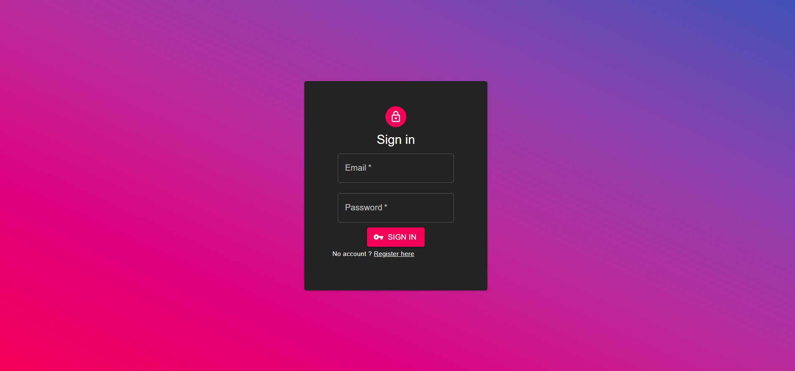

#### Registration Page (Desktop)

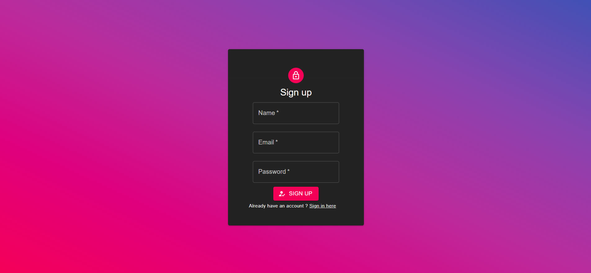

#### Welcome Page (Desktop)

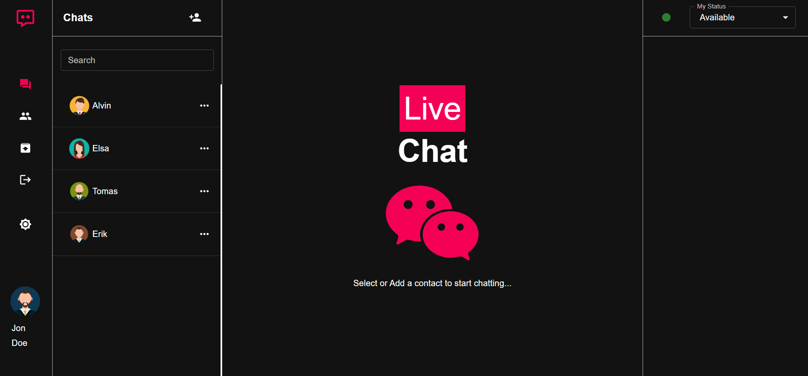

#### Welcome Page (Desktop & Light mode)

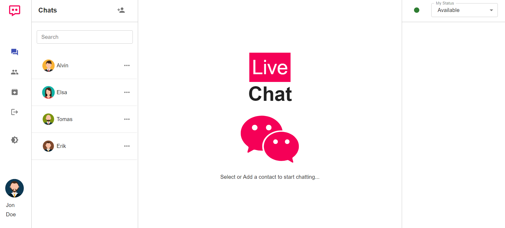

#### Welcome Page (Mobile)

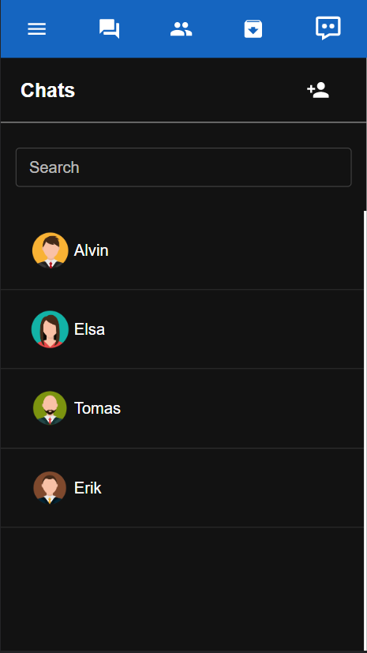

#### Welcome Page (Mobile & Light mode)

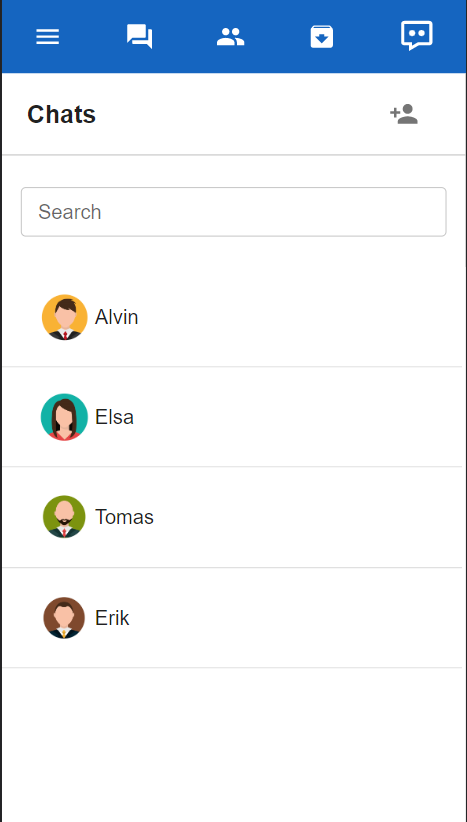

#### Chat UI (Desktop)

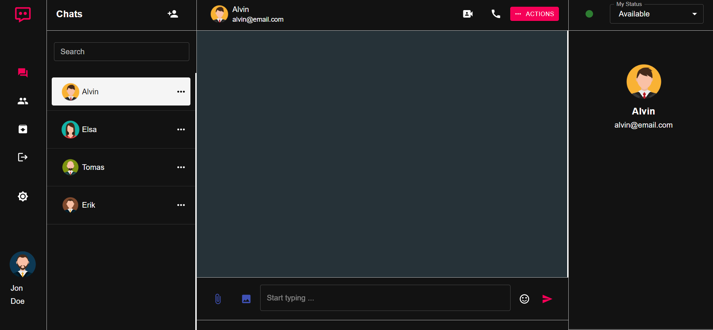

#### Chat UI (Desktop & Light mode)

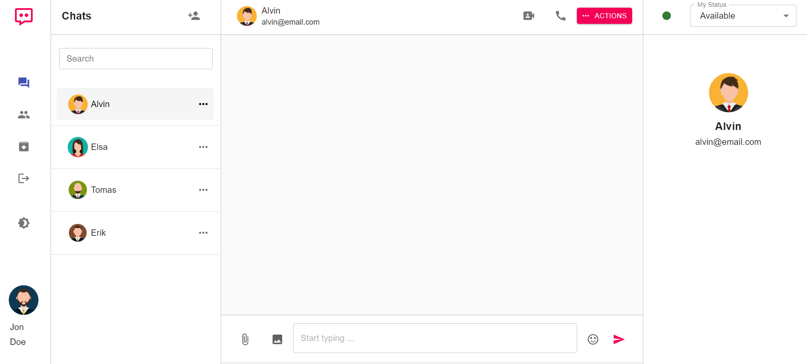

#### Chat UI (Mobile)

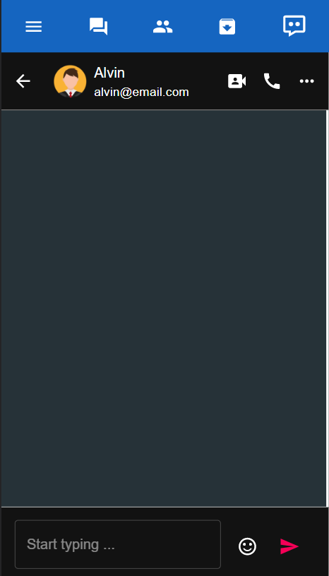

#### Chat UI (Mobile & Light mode)

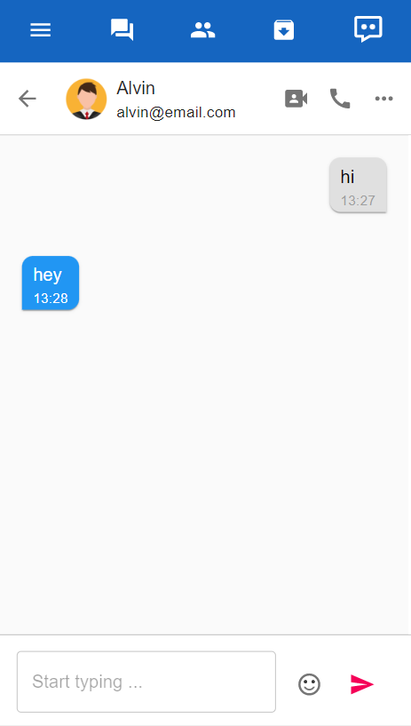

#### Profile sidebar UI (Mobile)

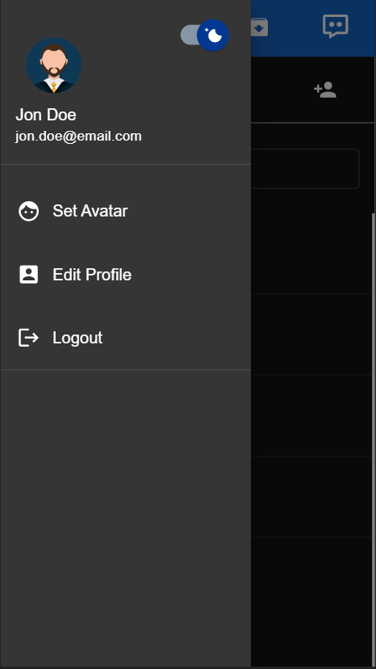

#### Profile sidebar UI (Mobile & Light mode)

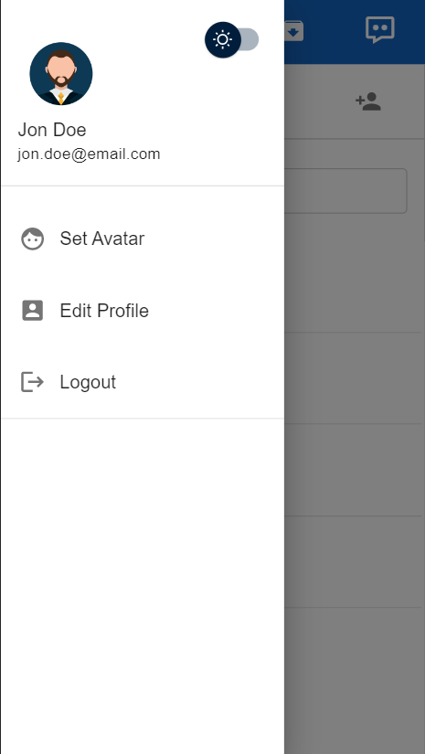

#### Avatars Page (Mobile)

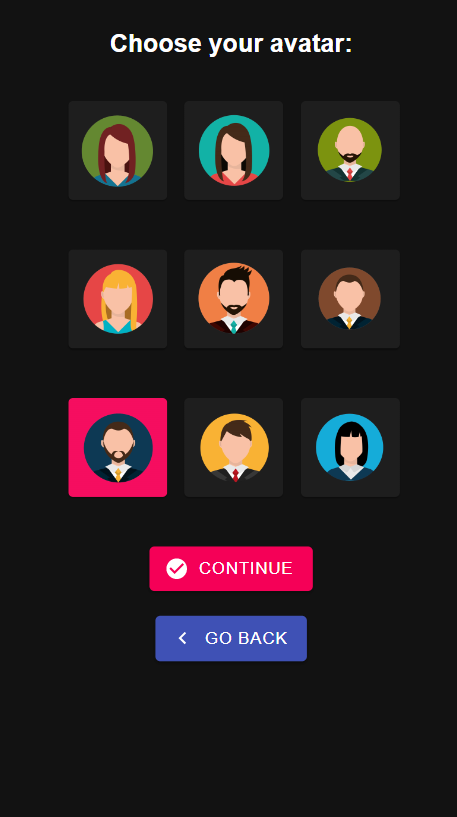

#### Avatars Page (Mobile & Light)

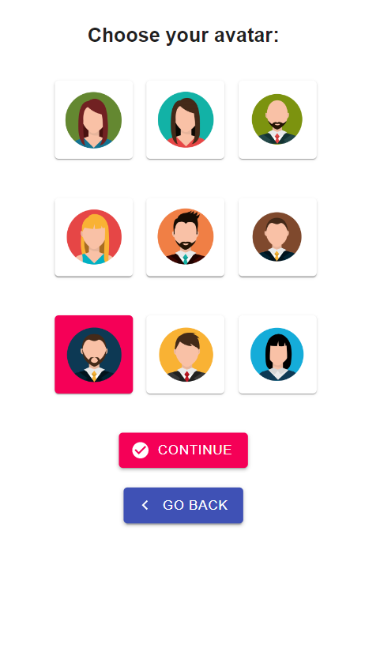
